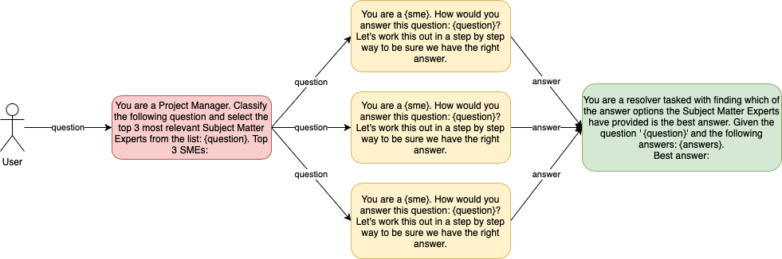

# Project Manager with multiple Subject Matter Experts (SMEs)

[](https://github.com/rhernaus/ProjectGPT/actions/workflows/unittests.yml)
[](https://rhernaus-projectgpt-app-s5m1hd.streamlit.app/)

This application uses OpenAI GPT models, state-of-the-art language models by OpenAI, to simulate a project manager who can provide expert answers to your questions across various fields.



## Table of Contents

- [Features](#features)
- [Requirements](#requirements)
- [Installation](#installation)
- [Usage](#usage)
- [Benchmark](#Benchmark)
- [Credits](#credits)

## Features

- Classify user input questions and select the top 3 most relevant Subject Matter Experts (SMEs) to provide answers.
- Consult with the selected SMEs to get their responses.
- Resolve and present the best answer from the SMEs.

## Requirements

- Python 3.8 or later
- OpenAI API key
- Streamlit
- Python-dotenv

## Installation

1. Clone the repository:

   ```
   git clone https://github.com/rhernaus/ProjectGPT.git
   cd ProjectGPT
   ```

2. Install the required packages:

   ```
   pip install -r requirements.txt
   ```

3. Optionally, create a `.env` file in the project root directory and add your OpenAI API key:

   ```
   OPENAI_API_KEY=your_api_key_here
   ```

## Usage

1. Run the Streamlit app:

   ```
   streamlit run app.py
   ```

2. Open the provided URL in your web browser.

3. Enter your question in the text area and click "Get Answers".

4. The app will display the selected Subject Matter Experts, their responses, and the best answer for your question.

## Benchmark

The following table shows the performance on the 57 tasks from the [MEASURING MASSIVE MULTITASK LANGUAGE UNDERSTANDING paper](https://arxiv.org/abs/2009.03300).

| Model                    | Mode           | Performance | Time (s) | Results |
|--------------------------|----------------|-------------|----------|---------|
| gpt-3.5-turbo            | Zero-shot      | 50.9%       | 153      | [file](results/performance_final_202305101112_gpt35turbo_direct.json) |
| gpt-4                    | Zero-shot      | 61.4%       | 251      | [file](results/performance_final_202305101117_gpt4_direct.json) |
| gpt-3.5-turbo            | Consult 3 SMEs | 50.9%       | 1127     | [file](results/performance_final_202305101429_gpt35turbo_consult.json) |
| gpt-4                    | Consult 3 SMEs | 73.7%       | 5429     | [file](results/performance_final_202305101607_gpt4_consult.json) |
| gpt-4                    | SmartGPT       | 75.4%       | 2494     | [file](results/performance_final_202305111445_gpt4_smart.json) |

## Credits

This application is built using:

- [OpenAI GPT-4](https://beta.openai.com/docs/models/gpt-4) and [GPT-3.5](https://beta.openai.com/docs/models/gpt-3-5) for generating expert responses.
- [Streamlit](https://www.streamlit.io/) for creating the web interface.