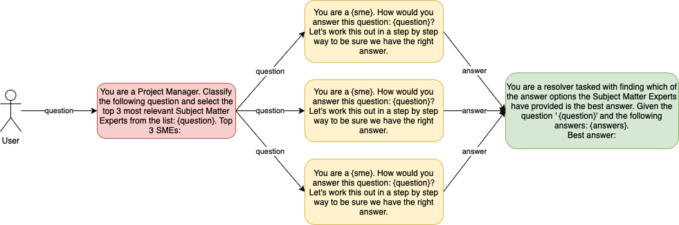

# Project Manager with multiple Subject Matter Experts (SMEs)

[](https://rhernaus-projectgpt-app-s5m1hd.streamlit.app/)

This application uses OpenAI GPT models, state-of-the-art language models by OpenAI, to simulate a project manager who can provide expert answers to your questions across various fields.



## Table of Contents

- [Features](#features)
- [Requirements](#requirements)
- [Installation](#installation)
- [Usage](#usage)
- [Examples](#examples)
- [Credits](#credits)

## Features

- Classify user input questions and select the top 3 most relevant Subject Matter Experts (SMEs) to provide answers.
- Consult with the selected SMEs to get their responses.
- Resolve and present the best answer from the SMEs.

## Requirements

- Python 3.8 or later
- OpenAI API key
- Streamlit
- Python-dotenv

## Installation

1. Clone the repository:

   ```
   git clone https://github.com/rhernaus/ProjectGPT.git
   cd ProjectGPT
   ```

2. Install the required packages:

   ```
   pip install -r requirements.txt
   ```

3. Optionally, create a `.env` file in the project root directory and add your OpenAI API key:

   ```
   OPENAI_API_KEY=your_api_key_here
   ```

## Usage

1. Run the Streamlit app:

   ```
   streamlit run app.py
   ```

2. Open the provided URL in your web browser.

3. Enter your question in the text area and click "Get Answers".

4. The app will display the selected Subject Matter Experts, their responses, and the best answer for your question.

## Examples

Q: One end of a Nichrome wire of length 2L and cross-sectional area A is attached to an end of another Nichrome wire of length L and cross- sectional area 2A. If the free end of the longer wire is at an electric potential of 8.0 volts, and the free end of the shorter wire is at an electric potential of 1.0 volt, the potential at the junction of the two wires is most nearly equal to
(A) 2.4 V
(B) 3.3 V
(C) 4.5 V
(D) 5.7 V

**Answers:**
| Model                   | Answer | Score       |
|-------------------------|--------|-------------|
| GPT-3.5                 | D      | Incorrect   |
| GPT-4                   | D      | Incorrect   |
| ProjectGPT with GPT-3.5 | C      | Incorrect   |
| ProjectGPT with GPT-4   | A      | **Correct** |

## Credits

This application is built using:

- [OpenAI GPT-4](https://beta.openai.com/docs/models/gpt-4) for generating expert responses.
- [Streamlit](https://www.streamlit.io/) for creating the web interface.
